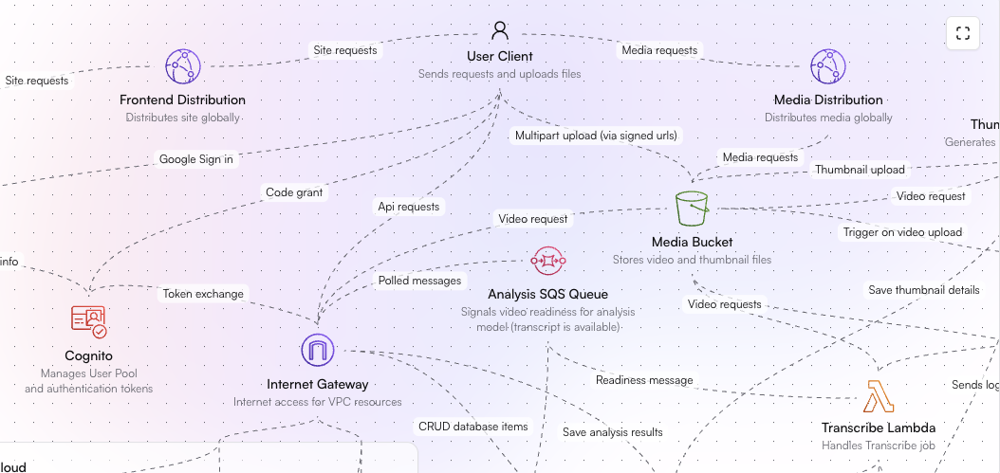
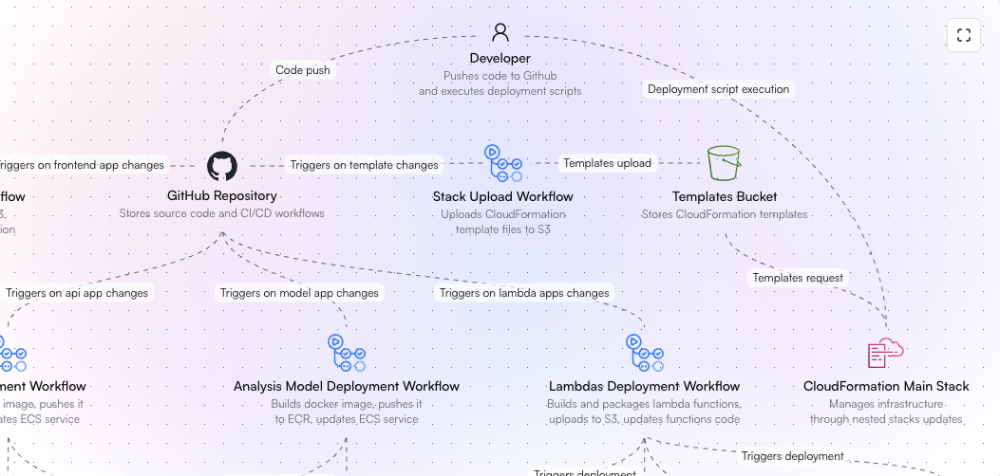

# Video Analysis Platform

A cloud-native demo platform that performs AI-powered video analysis using AWS services and custom machine learning models. This demo project objective is to showcases full-stack development, DevOps practices, and cloud architecture expertise.

## Overview

This platform allows users to upload videos and receive comprehensive AI analysis including:

- Transcription of speech and dialog with speaker identification
- Object detection with timestamps and confidence levels
- Video content summarization
- Custom prompt-based video analysis

The system is built as a modern web application with event-driven microservices architecture, leveraging AWS services and custom GPU-accelerated machine learning models.

### Key Features

- **Google Authentication**: Secure user authentication using AWS Cognito with Google Sign-In
- **Video Management**: Upload, store, and manage videos with public/private visibility
- **Multi-Model AI Analysis**:
  - Amazon Transcribe for speech-to-text
  - Amazon Rekognition for object detection
  - Custom Video-LLaVA model for summarization and prompt-based analysis
- **Real-time Progress Tracking**: Monitor the status of multiple AI analysis jobs
- **Scalable Infrastructure**: Auto-scaling components based on demand
- **Cost-Optimized Architecture**: GPU instances scale to zero when idle

### Architecture Diagram

You can checkout the interactive architecture diagram in the [main page of the project](https://video-analysis.bernardoquina.com). Here is a screenshot:



## Technical Stack

### Frontend

- **Next.js**: React framework for the client application
- **TailwindCSS**: Utility-first CSS framework
- **tRPC**: End-to-end typesafe APIs

### Backend Services

- **Node.js**: Runtime for API and Lambda functions
- **Express**: Web framework for the API service
- **tRPC**: End-to-end typesafe APIs
- **Python**: Custom ML model service
- **Video-LLaVA**: Open-source video analysis model

### Infrastructure

- **AWS Services**:
  - ECS (EC2): Container orchestration for API and ML services
  - ALB: API request distribution
  - Lambda: Serverless functions for video processing
  - S3: Video and static content storage
  - CloudFront: Content delivery network
  - DynamoDB: NoSQL database
  - Cognito: Authentication and user management
  - SQS: Message queue for ML tasks
  - EventBridge: Event routing
  - CloudWatch: Monitoring and logging
  - Route 53: DNS management
  - ACM: SSL certificate management
  - Amazon Transcribe
  - Amazon Rekognition

### DevOps

- **GitHub Actions**: CI/CD pipelines
- **CloudFormation**: Infrastructure as Code
- **Docker**: Container runtime
- **Turborepo**: Monorepo build system

### Repository Structure

```
BernardoQuina-video-analysis-platform/
├── .env.example
├── .prettierrc
├── .github/
│   ├── workflows/
│   │   ├── frontend-deploy.yml
│   │   ├── lambdas-deploy.yml
│   │   ├── api-deploy.yml
│   │   └── stack-upload.yml
├── apps/
│   ├── api/
│   │   ├── .env.example
│   │   ├── .eslintrc.json
│   │   ├── infrastructure/
│   │   ├── package.json
│   │   ├── env.ts
│   │   ├── Dockerfile
│   │   ├── tsconfig.json
│   │   └── src/
│   ├── transcribe-lambda/
│   │   ├── .env.example
│   │   ├── .DS_Store
│   │   ├── .eslintrc.json
│   │   ├── infrastructure/
│   │   ├── package.json
│   │   ├── env.ts
│   │   ├── tsconfig.json
│   │   └── src/
│   ├── frontend/
│   │   ├── .env.example
│   │   ├── next.config.mjs
│   │   ├── .eslintrc.json
│   │   ├── public/
│   │   ├── infrastructure/
│   │   ├── package.json
│   │   ├── env.ts
│   │   ├── postcss.config.mjs
│   │   ├── components.json
│   │   ├── tailwind.config.ts
│   │   ├── tsconfig.json
│   │   ├── README.md
│   │   └── src/
│   ├── analysis-model/
│   │   ├── config.py
│   │   ├── main.py
│   │   ├── video_llava.py
│   │   ├── aws_utils.py
│   │   ├── infrastructure/
│   │   ├── package.json
│   │   ├── requirements.txt
│   │   └── Dockerfile
│   ├── rekognition-lambda/
│   │   ├── .env.example
│   │   ├── .DS_Store
│   │   ├── .eslintrc.json
│   │   ├── infrastructure/
│   │   ├── package.json
│   │   ├── env.ts
│   │   ├── tsconfig.json
│   │   └── src/
│   └── thumbnail-lambda/
│       ├── .env.example
│       ├── .eslintrc.json
│       ├── infrastructure/
│       ├── package.json
│       ├── env.ts
│       ├── tsconfig.json
│       └── src/
├── .eslintrc.json
├── infrastructure/
│   ├── stacks/
│   ├── stack-deploy.sh
│   └── main.yml
├── package.json
├── packages/
│   └── db/
│       ├── .eslintrc.json
│       ├── package.json
│       ├── tsconfig.json
│       └── src/
└── turbo.json
```

## Infrastructure Architecture

### Network Architecture

- **VPC Configuration**:
  - 6 subnets across 2 availability zones
  - Public subnets for ALB and EC2 instances
  - Internet Gateway for public internet access
  - Security groups controlling inbound/outbound traffic

### Service Components

#### Frontend Delivery

- Static site hosted on S3
- CloudFront distribution with custom domain
- CloudFront Function for SPA routing
- SSL/TLS certificate via ACM

#### API Service (ECS Cluster)

- Application Load Balancer with TLS termination
- ECS tasks running on t2.micro instances
- Auto-scaling based on CPU/Memory metrics
- Minimum of 1 instance, maximum of 2
- Custom domain via Route 53

#### Analysis Model Service (ECS Cluster)

- GPU-enabled g4dn.xlarge instances
- Scales from 0 to 1 based on SQS queue length
- Custom CloudWatch metrics for scaling
- Cost optimization through scale-to-zero

#### Lambda Functions

1. **Thumbnail Lambda**:

   - Generates video thumbnails using FFmpeg
   - Triggered by S3 video uploads
   - Stores thumbnails back to S3

2. **Rekognition Lambda**:

   - Manages Amazon Rekognition video analysis jobs
   - Processes and stores detection results
   - Triggered by S3 video uploads

3. **Transcribe Lambda**:
   - Manages Amazon Transcribe jobs
   - Processes transcription results
   - Triggers custom analysis via SQS
   - Triggered by S3 video uploads

### Storage & Database

- **DynamoDB**: Single-table design for:

  - Video metadata
  - Analysis results
  - User sessions
  - User limits

- **S3 Buckets**:
  - Video storage with CloudFront distribution
  - Frontend static files
  - Lambda deployment packages
  - CloudFormation templates

### Authentication Flow

1. User authentication via Cognito User Pool
2. Google OAuth integration
3. JWT token management
4. Secure session handling with refresh tokens

## Application Components

### Frontend Application

- **Purpose**: Provides the user interface for video upload and analysis
- **Key Features**:
  - Responsive design
  - Real-time analysis status updates
  - Video player with analysis results
  - Drag-and-drop file upload
- **Environment Variables**:
  ```bash
  NEXT_PUBLIC_API_URL= # Api url (domain associated to the ALB)
  NEXT_PUBLIC_MEDIA_URL= # Domain associated to the video storage buckect cloudfront distribution
  NEXT_PUBLIC_COGNITO_DOMAIN= # Your Cognito domain
  NEXT_PUBLIC_COGNITO_CLIENT_ID= # Cognito User Pool Client ID
  ```
- **Local Development**:
  ```bash
  cd apps/frontend
  npm install
  npm run dev
  ```

### API Service

- **Purpose**: Handles client requests and orchestrates backend services
- **Key Features**:
  - tRPC endpoints
  - S3 presigned URL generation
  - Authentication middleware
  - Session management
- **Environment Variables**:
  ```bash
  NODE_ENV= # development | test | production
  FRONTEND_URL= # frontend url to set cors origin
  COGNITO_CLIENT_ID= # Cognito User Pool Client ID
  COGNITO_CLIENT_SECRET= # Cognito User Pool Client Secret
  COGNITO_USER_POOL_ID= # Cognito User Pool ID
  COGNITO_DOMAIN= # Cognito domain (where authentication and token requests are made)
  AWS_REGION= # AWS region of your user pool
  DYNAMODB_TABLE_NAME= # Name of the dynamoDB table (prod-table is our default)
  VIDEO_STORAGE_S3_BUCKET_NAME= # Name of the S3 bucket that stores uploaded videos
  ```
- **Local Development**:
  ```bash
  cd apps/api
  npm install
  npm run dev
  ```

### Analysis Model Service

- **Purpose**: Processes videos using Video-LLaVA model
- **Key Features**:
  - GPU acceleration
  - SQS message polling
  - Batch processing
  - Error handling and retries
- **Environment Variables**:
  ```python
  AWS_REGION = os.getenv("AWS_REGION")
  SQS_QUEUE_URL = os.getenv("SQS_QUEUE_URL")
  DYNAMODB_TABLE_NAME = os.getenv("DYNAMODB_TABLE_NAME")
  MODEL_NAME = "LanguageBind/Video-LLaVA-7B-hf"
  MAX_NEW_TOKENS = 5000
  PROMPT_PREFIX = "USER: <video>\n"
  PROMPT_SUFFIX = " ASSISTANT:"
  ```
- **Local Development**:
  ```bash
  cd apps/analysis-model
  pip install -r requirements.txt
  python video-llava.py
  ```

### Thumbnail Lambda

- **Purpose**: Generates video thumbnails upon upload
- **Key Features**:
  - FFmpeg integration for frame extraction
  - S3 event handling
  - Thumbnail optimization
  - Database status updates
- **Environment Variables**:
  ```bash
  AWS_REGION=
  DYNAMODB_TABLE_NAME= # Name of the dynamoDB table (prod-table is our default)
  FFMPEG_PATH=/opt/ffmpeg/ffmpeg
  FFPROBE_PATH=/opt/ffmpeg/ffprobe
  ```
- **Local Development**:
  ```bash
  cd apps/thumbnail-lambda
  npm install
  npm run dev
  ```

### Transcribe Lambda

- **Purpose**: Manages Amazon Transcribe jobs for video audio analysis
- **Key Features**:
  - Transcription job management
  - Speaker identification
  - SQS message publishing for analysis model
  - Timestamp synchronization
- **Environment Variables**:
  ```bash
  AWS_REGION=
  DYNAMODB_TABLE_NAME= # Name of the dynamoDB table (prod-table is our default)
  SQS_QUEUE_URL= # Custom Analysis Queue URL
  ```
- **Local Development**:
  ```bash
  cd apps/transcribe-lambda
  npm install
  npm run dev
  ```

### Rekognition Lambda

- **Purpose**: Handles Amazon Rekognition video analysis jobs
- **Key Features**:
  - Object and scene detection
  - Activity recognition
  - Confidence scoring
  - Temporal metadata organization
- **Configuration**:
  ```bash
  AWS_REGION=
  DYNAMODB_TABLE_NAME= # Name of the dynamoDB table (prod-table is our default)
  ```
- **Local Development**:
  ```bash
  cd apps/rekognition-lambda
  npm install
  npm run dev
  ```

## Deployment & CI/CD

### Deployment Prerequisites

1. **AWS Resources**:

- Pre-created S3 buckets:
  - Stack templates bucket
  - Lambda code bucket
- ECR repositories:
  - API repository
  - Analysis model repository
- Route 53 hosted zone
- ACM certificates (in us-east-1 for CloudFront)
- Create OICD provider for GitHub actions and store the role arn as a secret ([follow this step-by-step guide](https://medium.com/israeli-tech-radar/openid-connect-and-github-actions-to-authenticate-with-amazon-web-services-9a66b3b88e92))

2. **Environment Variables (for infra deployment)**:

```bash
# AWS Configuration
ACCOUNT_ID=
EC2_KEY_PAIR_NAME= # Name of the key pair used to then ssh into instances

# S3 Buckets
STACK_TEMPLATES_S3_BUCKET_NAME= # Pre-create this bucket
LAMBDAS_CODE_S3_BUCKET_NAME= # Pre-create this bucket
VIDEO_STORAGE_S3_BUCKET_NAME=
FRONTEND_S3_BUCKET_NAME=

# DNS
HOSTED_ZONE_ID= # Id of the domain hosted zone to create validation CNAME record for the ACM certificate for the ALB
CERTIFICATE_ARN= # Manually created certificate for the domain to used with cloudfront (not included in this cloudformation because it has to be in us-east-1)

# Domain Names
FRONTEND_DOMAIN_NAME=
API_DOMAIN_NAME=
MEDIA_DOMAIN_NAME=


# ECR Repositories
API_ECR_REPOSITORY_NAME=
ANALYSIS_MODEL_ECR_REPOSITORY_NAME=

# Authentication
GOOGLE_CLIENT_ID=
GOOGLE_CLIENT_SECRET=
APP_DOMAIN_PREFIX=
```

3. **Run CloudFormation deployment script**:

```bash
  npm run deploy-main
```

### GitHub Actions Workflows

You can checkout the interactive CI/CD workflow diagram in the [main page of the project](https://video-analysis.bernardoquina.com). Here is a screenshot:



1. **Stack Upload Workflow** (`stack-upload.yml`)

- Triggers: Changes to CloudFormation templates
- Actions:
  - Uploads templates to S3
  - Enables CloudFormation to fetch latest infrastructure definitions
- Files monitored:
  ```
  - infrastructure/**.yml
  - apps/*/infrastructure/**.yml
  ```
- Secrets required on GitHub:
  ```
  AWS_ROLE_ARN
  STACK_TEMPLATES_S3_BUCKET_NAME
  ```

2. **Frontend Deployment** (`frontend-deploy.yml`)

- Triggers: Changes to frontend app code
- Actions:
  - Builds Next.js static site
  - Syncs to S3 bucket
  - Invalidates CloudFront cache
- Files monitored:
  ```
  - 'apps/frontend/**'
  ```
- Secrets required on GitHub:
  ```
  AWS_ROLE_ARN
  FRONTEND_S3_BUCKET_NAME
  CLOUDFRONT_DISTRIBUTION_ID
  ```
- Environment variables required on GitHub:
  ```
  NEXT_PUBLIC_API_URL
  NEXT_PUBLIC_MEDIA_URL
  NEXT_PUBLIC_COGNITO_DOMAIN
  NEXT_PUBLIC_COGNITO_CLIENT_ID
  ```

3. **Lambda Deployment** (`lambdas-deploy.yml`)

- Triggers: Changes to any Lambda function code
- Actions:
  - Builds and packages Lambda functions
  - Uploads to S3
  - Updates Lambda function code
- Files monitored:
  ```
  - 'apps/transcribe-lambda/**'
  - 'apps/rekognition-lambda/**'
  - 'apps/thumbnail-lambda/**'
  ```
- Secrets required on GitHub:
  ```
  AWS_ROLE_ARN
  LAMBDAS_CODE_S3_BUCKET_NAME
  ```
- Environment variables required on GitHub:
  ```
  ENVIRONMENT_NAME
  ```
- Handles:
  - Transcribe Lambda
  - Rekognition Lambda
  - Thumbnail Lambda

4. **API Deployment** (`api-deploy.yml`)

- Triggers: Changes to API service code
- Actions:
  - Builds Docker image
  - Pushes to ECR
  - Updates ECS service
- Files monitored:
  ```
  - 'apps/api/**'
  - 'packages/db/**'
  ```
- Secrets required on GitHub:
  ```
  AWS_ROLE_ARN
  API_ECR_REPOSITORY_NAME
  API_CLUSTER_NAME
  API_SERVICE_NAME
  ```
- Rolling deployment strategy

5. **Analysis Model Deployment** (Manual)

- Due to large model size (~25GB), deployment is manual (workflow still works with larger runner)
- Process:
  - Build Docker image locally
  - Push to ECR
  - Update ECS service

## Local Development

### Setup Steps

1. **Clone and Install Dependencies**

```bash
git clone https://github.com/[username]/video-analysis-platform.git
cd video-analysis-platform
npm install
```

2. **Environment Configuration**

```bash
# Copy environment files and fill variables
cp .env.example .env
cp apps/api/.env.example apps/api/.env
cp apps/frontend/.env.example apps/frontend/.env
# ... repeat for other apps
```

3. **Start Development Servers**

```bash
# Start all services
npm run dev

# Or start individual services
npm run dev -- --filter=frontend
npm run dev -- --filter=api
```

### Prerequisites

- Node.js v20+
- Python 3.10+
- Docker
- AWS CLI configured
- NVIDIA drivers (for analysis model)

## Security Considerations

### IAM Roles and Permissions

- Principle of least privilege
- Service-specific IAM roles
- Resource-based policies
- Cross-service permissions

### Network Security

- VPC security groups
- ALB with TLS termination
- CloudFront with custom SSL
- Private subnet isolation (recommended for production)

### Authentication & Authorization

- Cognito User Pools
- JWT token validation
- Session management
- CORS configuration

### Data Security

- S3 bucket policies
- DynamoDB encryption
- CloudFront signed URLs
- Environment variable management

## Logging and Monitoring

### CloudWatch Logs

- API service logs: `/ecs/api`
- Analysis model logs: `/ecs/analysis-model`
- Lambda logs:
  - `/lambda/transcribe`
  - `/lambda/rekognition`
  - `/lambda/thumbnail`

### Metrics and Alarms

- ECS cluster metrics
  - CPU utilization
  - Memory utilization
- SQS queue metrics
  - Queue length
  - Message age
- Custom metrics
  - Backlog per task
  - Processing time

### Monitoring Dashboards

- Service health
- Auto-scaling events
- Error rates
- API latency

### Cost Monitoring

- GPU instance usage
- S3 storage and transfer
- CloudFront distribution
- Lambda invocations
